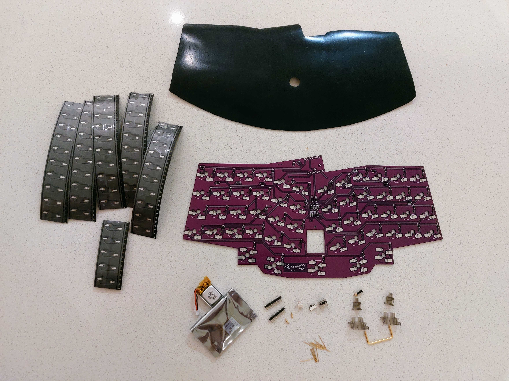

# Rev41 Keyboard

## Layer Controls

| Name               | Combo                                     | Description                                  |
| ------------------ | ----------------------------------------- | -------------------------------------------- |
| **Function Layer** | `L-Function` + `R-Function`               | Press both Function keys simultaneously      |
| **Colemak Layout** | `ESC` + `-` + `FN` + `\`                  | Press all four corner keys                   |
| **Gaming Layer**   | `ESC` + `-` + `L-Function` + `R-Function` | Press top ~~corners~~ and both Function keys |
| **Qwerty (Mac)**   | `ESC` + `-` + `L-CTRL` + `R-CTRL`         | Press top corners and both CTRL keys (F & J) |

## Bluetooth Connection Management

### Pairing New Devices

1. Enter the Function layer (Layer 2) using the outer thumb keys
2. Select a Bluetooth profile (1-5) using these keys:
   - Profile 1: `N`
   - Profile 2: `M`
   - Profile 3: `,`
   - Profile 4: `.`
   - Profile 5: `/`

### Clearing Bluetooth Connections

1. Enter the Function layer
2. Select the profile you want to clear using the keys above
3. Press `\` to clear the selected profile

### Troubleshooting Connection Issues

1. Remove the device from your computer:
   - macOS: System Settings → Bluetooth → Select device → "Forget This Device"
   - Windows: Settings → Bluetooth & devices → Select device → Remove device
2. Clear the keyboard's Bluetooth profile using the steps above
3. Attempt to pair again

### Battery Management

- The battery only charges when the power switch is ON
- Turning the power switch OFF completely disconnects the battery

## Hardware Components

[3D Printable Case Files](https://www.thingiverse.com/thing:6831308)

### Parts List

| Component              | Quantity | Notes                     |
| ---------------------- | -------- | ------------------------- |
| PCB                    | 1        | Main circuit board        |
| Seeed Studio XIAO BLE  | 1        | Main controller           |
| Hot-swap sockets       | 55       | For switches              |
| 120mAh battery         | 1        | With 1.25mm JST connector |
| 1.25mm JST female plug | 1        | For battery connection    |
| Power switch           | 1        |                           |
| Reset switch           | 1        |                           |
| Hex screw              | 1        |                           |
| Hex nut                | 1        | Heat mounted              |
| Stabilizer             | 1        | For spacebar              |
| Pogo pins              | 2        |                           |
| 7-pin millmax headers  | 2        |                           |
| Millmax pins           | 15       |                           |
| Magnets                | 6        |                           |
| Silicon sticker feet   | 1        | Non-slip                  |

## Credits

Based on the [REVIUNG41](https://github.com/gtips/reviung/tree/master/reviung41) keyboard design.
